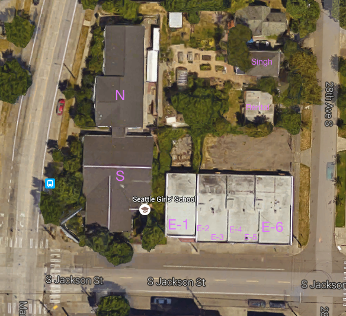

Campus Maps:: Buildings
=======================

The campus has multiple buildings.

The main buildings are parallel to MLK in a North South division. The north building has two floors.

The "E" buildings are a collection of office fronts facing Jackson St. 

- E-1 is an operational classroom for A & W
- E-2 is the Business Offices
- E-3 is off-limits storage
- E-4 is optional staffing offices
- E-5 is an operational classroom for the Music Lab
- E-6 is an operational classroom for the Art Lab

The "Pumpkin" House is a residential unit.

The "Singh House" is in the NE corner parallel to 28th st and contains the "Urban Garden" space in it's backyard.

