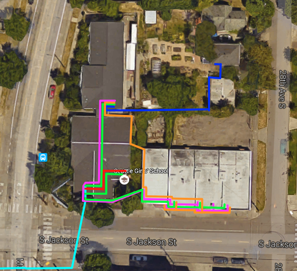

Campus Maps:: Cat6 Runs
=======================

Late 2015, we replace the aging intra-building Cat5 runs with Cat6 runs. Each run has a secondary cable on standby in case of cuts or other damage.

The **cyan** feed indidates the external wire path of the 200 Mbps Fiber Optic cable that is provided by Wave Broadband. This link is the primary Internet connection for the campus.

.. warning:: Single Point of Failure

   If the Fiber Line is cut, the campus will be without Internet Access!

The **green** feeds indicate the coverage of the core LAN between the campus buildings.

.. warning:: Single Points of Failure

   If the NOC to Server Room line is cut, access to local shares will fail.
   If the NOC to Phone Room line is cut, the Phone System will fail.
   If the NOC to East Buildings is cut, all East Clients will be unable to access the Campus Network

The **red** feed indicates the expansion of the DMZ network from the Network Closet to the Server Room.

.. warning:: Single Point of Failure

   If the DMZ WAN Line is cut, external clients will not be able to run backups to CrashPlan! Additionally, routing of e-mail from seattlegirlsschool.org to sgs-wa.org will fail.

The **blue** feed indicates the connection between the phone room swicthes and the Singh House.

.. warning:: Single Point of Failure

   If the Singh House Line is cut, phones, printers and wireless connections will all fail in the Singh House.

The **orange** feed indicates the path that connects the Phone system to the East buildings. We layer a pair to each digital line from the Mitel 5000 system to phones in the E Buildings.

.. warning:: Single Points of Failure

   Each Cat6 line from the Phone Room to the Splitter Box in E-4 contains 4 digital lines. 4 Cat6 lines contain the bulk of phone support ti the E Buiding. There are spare lines over-provisioned in case of cut damage.
