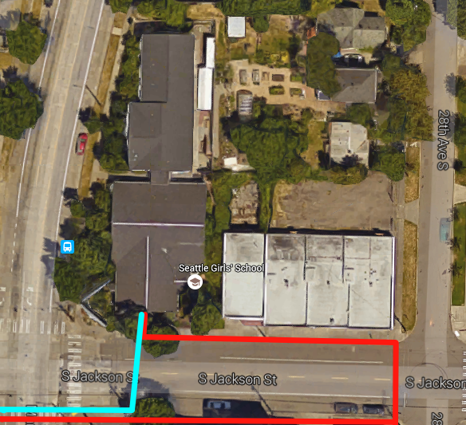

Campus Maps:: Internet/Phone Feeds
==================================

The campus has dual feeds out to the Internet serving distinct purposes.

The **cyan** feed indidates the external wire path of the 200 Mbps Fiber Optic cable that is provided by Wave Broadband. This link is the primary Internet connection for the campus.

.. warning:: Single Point of Failure

   If the Fiber Line is cut, the campus will be without Internet Access!

The **red** feed indicates the external wire path of the 3 Mbps Ethernet over Cable (EoC) feed that is provided by Integra-Telecom. This is a dedicated line for telephone usage only and does *not* provide Internet bandwidth for the campus.

.. warning:: Single Point of Failure

   If the EoC Line is cut, the campus will be without Phone and FAX Service!
