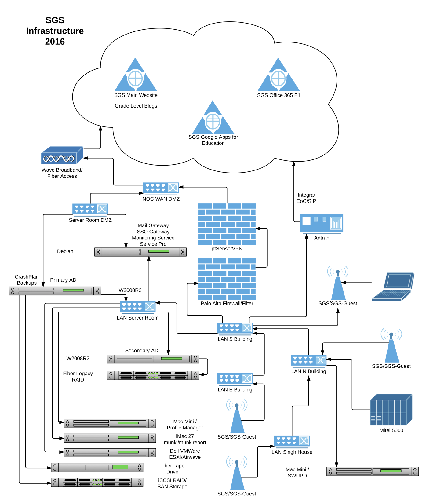
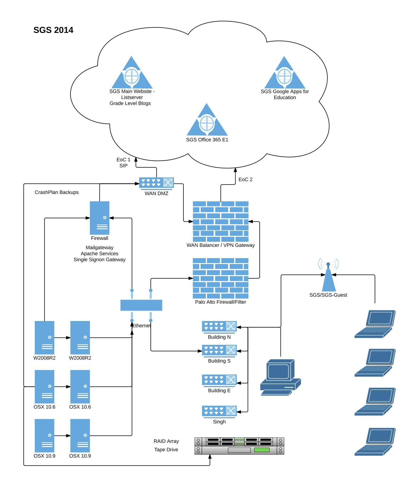
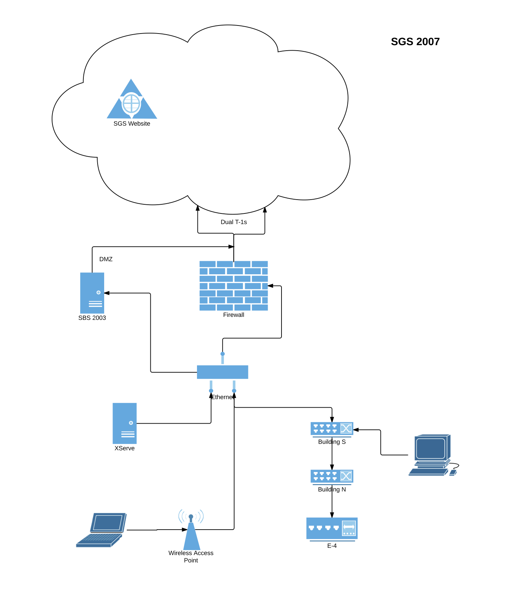

Servers
=======

The SGS Servers have gone through a few major revisions during my tour of duty.

**Current**

XServes were deprecated the summer of 2015 ( unplanned ).

We converted from dual EoCs to a singular Fiber Optic connection in the Fall of 2016.

**Recent**

**Migrations**

We tried a full Open Directory implementation for one year ( retire Active Directory and emulate with Samba ). In practice, this was a poor solution for Windows clients.

**Originating**

.. warning::

   SBS 2003 had no external DMZ filtering in place
   No campus wide backups
   Frail storage media

